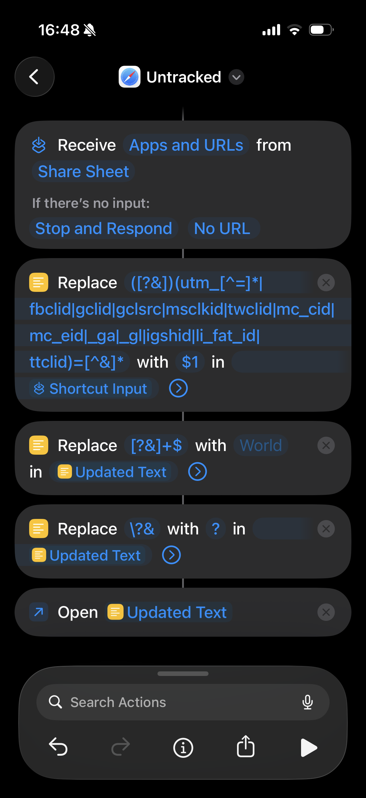

# Untracked

A minimal Vivaldi/Chromium extension that silently strips tracking query
parameters (UTM, `fbclid`, `gclid`, etc.) from URLs before a page loads.
No UI, no configuration, no telemetry — it just works.

## What it does

When you navigate to a URL, Untracked checks the query string for known
tracking parameters. If any are found, it removes them and redirects the
tab to the cleaned URL before the original page loads — so the page you
end up on, your history, and anything you copy or share carry the clean
URL.

**What it does not guarantee:** the original request is usually already
on its way to the server by the time the extension reacts, because
Manifest V3 only lets an extension *observe* navigations, not block
them. In practice the destination server often sees the tracked request
briefly, followed by the cleaned one. Untracked stops the tracked URL
from becoming the page you land on; it does not hide the click from the
server. See "Security Considerations" in `SPEC.md` for the details.

Example:

```text
https://example.com?utm_source=newsletter&page=1
→ https://example.com?page=1
```

Non-tracking parameters, fragments (`#section`), and the rest of the URL
are left untouched.

## Disabling it on a specific site

Some sites break when their tracking params are stripped — marketing
redirect links (e.g. Eloqua's `.../e/er?...utm_campaign=...`) sometimes
validate the redirect against the full original query string, so removing
`utm_*` params makes the link fail instead of just landing on a cleaner
URL.

Click the Untracked icon in the toolbar to toggle stripping for the
current tab's hostname. The icon's badge always shows the state for the
tab you're on: green **ON** when active, red **OFF** when you've disabled
it for that site. The choice is remembered (per exact hostname, not the
whole site) across browser restarts.

To see every site you've excluded, or to re-enable one without
revisiting it: right-click the toolbar icon and choose **Options** (or
open the extension's card in `vivaldi://extensions` and click **Extension
options**).

## Install in Vivaldi

1. Clone or download this repository.
2. Open `vivaldi://extensions` in Vivaldi.
3. Enable **Developer mode** (top right).
4. Click **Load unpacked** and select the repository folder.

That's it — no build step, no dependencies. To pick up code changes,
click the refresh icon on the extension's card in `vivaldi://extensions`.

## iPhone equivalent (Shortcuts app)

iOS Safari doesn't support extensions that rewrite a URL before the page
loads, so there's no direct port of Untracked. You can get close with a
Shortcut invoked from the Share Sheet — but note the important caveat:
**the cleanup happens after you've already opened the page**, since
Shortcuts can only act on a URL you hand it, not intercept navigation
before it happens. In most cases this means the tracking parameters do
reach the destination server; the shortcut just gives you a clean link
to re-share or save afterward.

1. Open the **Shortcuts** app and create a new shortcut.
2. Add **Receive Apps and URLs from Share Sheet**. Under "If there's no
   input", set it to **Stop and Respond** with something like "No URL".
3. Add a **Replace Text** action with **Regular Expression** enabled:
   - Find: `([?&])(utm_[^=]*|fbclid|gclid|gclsrc|msclkid|twclid|mc_cid|mc_eid|_ga|_gl|igshid|li_fat_id|ttclid|_bhlid)=[^&]*`
   - Replace: `$1`
   - Input: **Shortcut Input**
4. Add another **Replace Text** action (regex enabled), taking the
   previous step's **Updated Text** as input:
   - Find: `[?&]+$`
   - Replace: *(leave empty — on iOS 27+ where the field defaults to
     "World", type a single space instead; the Open URL action trims
     trailing whitespace)*
5. Add another **Replace Text** action (regex enabled), again on the
   previous **Updated Text**, to collapse a leftover `?&` into `?`:
   - Find: `\?&`
   - Replace: `?`
6. Add an **Open URL** action with the cleaned result — for example
   `readwise://reader/add?url=[Replace Text Result]` to send it straight
   to Readwise Reader, or just use the **Updated Text** value directly to
   reopen the cleaned link in Safari.
7. In the shortcut's settings (the ⓘ icon), enable **Show in Share
   Sheet** so it's offered whenever you share a URL from Safari or
   another app.

Since the cleanup runs after the page has already been visited, treat
this as a way to produce a clean link for sharing or saving — not a
substitute for the extension's before-load stripping.

Below is a screenshot of my shortcut:



## Adding custom tracking parameters

Open `strip.mjs` and add the parameter name to the `TRACKED_PARAMS` list:

```js
const TRACKED_PARAMS = new Set([
  "utm_source",
  // ...
  "my_custom_param", // add your param here
]);
```

Any parameter starting with `utm_` is stripped automatically, even if
it's not explicitly listed, so you don't need to add every `utm_*`
variant by hand.

## Running the tests

```bash
node --test
```

No dependencies required — this uses Node's built-in test runner against
the pure logic in `strip.mjs`. The same command runs in CI on every push
and pull request, alongside super-linter.

## Pre-commit hooks

This repo uses [pre-commit](https://pre-commit.com/) to catch problems
before they're committed: JSON validity, JS syntax, `node --test`, and a
guard against accidentally adding `package.json`/`node_modules`. One-time
setup after cloning:

```bash
pip install pre-commit  # or: brew install pre-commit / pipx install pre-commit
pre-commit install
```

After that it runs automatically on `git commit`. Run it manually against
everything with `pre-commit run --all-files`.

## Security

Every URL this extension touches comes from the open internet, so it's
written defensively: parsing uses the browser's native `URL` API (no
regex), and a per-tab circuit breaker (`redirect-guard.mjs`) stops the
auto-redirect if a page tries to turn it into a loop. See "Security
Considerations" in `SPEC.md` for the full threat model.

## What it doesn't do (v1)

- No options/settings page (the per-site toggle above is a single toolbar
  button, not a configuration UI)
- No cookie or localStorage cleanup
- No network request or tracking-pixel blocking
- No Firefox support
- Not published to the Chrome Web Store

See `SPEC.md` for the full design and future considerations.

## License

MIT
